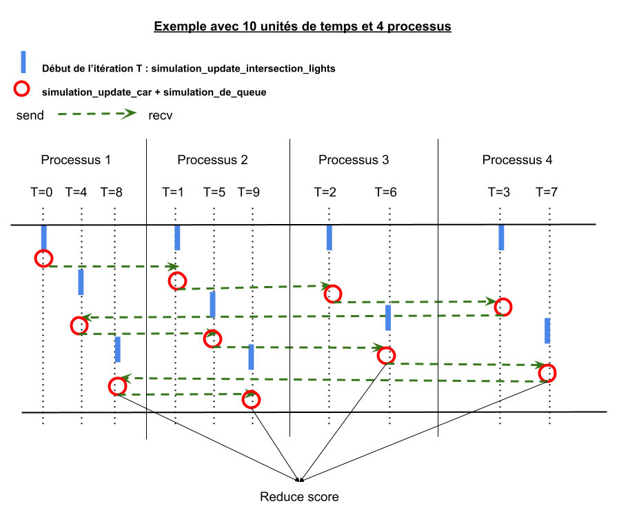

# Rapport de Projet OpenMP/MPI
L3 informatique

**Siham Janati**
**Abdelheq Delmi Bouras**

## Environnement

Le système utilisé pour réaliser les tests et les mesures de performances est :

```
OS : Linux sihartist-ROG-Strix-G531GT-G531GT 5.4.0-52-generic #57~18.04.1-Ubuntu SMP Thu Oct 15 14:04:49 UTC 2020 x86_64 x86_64 x86_64 GNU/Linux
OS dans une machine physique
#processeurs: 12
intel hyper-threading : Thread(s) per core:  2
compilateur(s) :
- gcc (Ubuntu 7.5.0-3ubuntu1~18.04) 7.5.0
```

## HASHCODE

### Explications

Le but de ce projet est de paralléliser un code pour améliorer ses performances, en utilisant OpenMP et MPI dans les sections qui nous intéressent.
Ce code prends en entrée le plan urbain d'une ville et les chemins planifiés de toutes ses voitures, et doit renvoyer un planning optimale pour les feux d'intersections pour permettre à un nombre maximum de voiture de finir leurs trajets, c'est suivant ce critère que le score final est calculé.


### Etude du code et définition des sections à paralléliser

Nous nous intéressons dans ce projet au fichier *checker.c* uniquement, notamment les deux fonctions *solution_check* et *solution_score*.
La fonction *solution_check* vérifie que la solution proposé est valide, la fonction *solution_score* calcule le score total obtenu, la partie la plus importante du travail portera sur cette dernière.

***Solution_check***
Cette fonction vérifie que les données fournies dans le fichier solution correspondent bien au plan de la ville et aux chemins définie dans le fichier problème.
Le code boucle sur toutes les intersections une par une et vérifie que les informations de chacune correspondent. Si tout se passe bien, le code de retour est 0, sinon le nombre d'erreurs trouvés.  

***Solution_score***
Cette fonction ne fait qu'appeler *simulation_run* qui fait toute l'exécution et renvoie le score. On aurait pu supprimer *solution_score* et ne garder que *simulation_run*, tout le code de *solution_score* ne s'exécute pas à part l'appel à *simulation_run*.
*simulation_run* commence par une initialisation des feux d'intersections et de la positions des voitures, ensuite elle met à jour ces derniers après chaque passage d'une unité de temps. C'est ce que fait la plus grande boucle dans cette fonction. Pour partager équitablement la charge entre tous les processus et maximiser les performances, il serait plus judicieux d'utiliser MPI sur cette boucle et OpenMP sur les boucles à l'intérieur de cette dernière. Il y a par contre des dépendances entre les itérations qu'il faudra prendre en considération.
Nous expliquerons notre parallélisation plus en détails dans les sections suivantes.

### Parallélisation MPI  

Ci-dessous un schéma représentant la parallélisation de *simulation_score* avec MPI:  




Les feux de circulations sont indépendants de la position de la voiture et ne dépendent que de T, il y a donc moyen de calculer l'état des feux pendant que le processus d'avant calcule l'état des voitures.
Par contre, après le calcul de l'état des voitures, on modifie à nouveau les intersections sauf qu'on ne modifie pas les mêmes attributs. Au départ, on modifie les feux, mais à la fin de l'itération on modifie le nombre de voiture présentes dans l'intersection. Si le processus suivant reçoit ses modifications, il va écraser l'état des feux qu'il à mis à jour au début de son itération, il est nécessaire donc de recevoir les nouvelles modifications dans une nouvelle variable (*street_state_t temp*), puis de copier les nouvelles valeurs du nombre de voiture uniquement sans toucher à l'état des feux dans la variable *street_state* (ensemble du code plus bas):
```
if( total_processes > 1 && T != 0){
	MPI_Status status;
	MPI_Recv(&temp, 4*NB_STREETS_MAX, MPI_INT, (rang - 1)%total_processes, 0, MPI_COMM_WORLD, &status);
	MPI_Recv(&car_state, 5*NB_CARS_MAX, MPI_INT, (rang - 1)%total_processes, 0, MPI_COMM_WORLD, &status);

	#pragma omp parallel for
	for(int i=0; i<NB_STREETS_MAX; i++){
		street_state[i].nb_cars = temp[i].nb_cars;
		street_state[i].out = temp[i].out;
	}
}
```

Ensuite après réception des nouvelles valeurs, on peut passer à la mise à jour de l'état des voitures, puis celle des intersections (nombre de voitures présentes à la fin) puis les envoyer au processus suivant.

La variable *bonus* est utile quand le nombre de processus ne divise pas les unités de temps. On l'utilise pour partager les unités de temps restante équitablement.

Quand le nombre de processus dépasse le nombre des unités de temps, les processus en plus ne travaillent pas. Le programme prend en considérant toutes ses situations.

#### code central

```
for(int T = rang; T < rang + total_processes*(units_per_process+bonus); T += total_processes ){

	#pragma omp parallel for
	for (int i = 0; i < s->A; i++)
			simulation_update_intersection_lights(s, i, T);

	// recv prev info car & lights, & update lights
	street_state_t temp[NB_STREETS_MAX];

	if( total_processes > 1 && T != 0){
		MPI_Status status;
		MPI_Recv(&temp, 4*NB_STREETS_MAX, MPI_INT, (rang - 1)%total_processes, 0, MPI_COMM_WORLD, &status);
		MPI_Recv(&car_state, 5*NB_CARS_MAX, MPI_INT, (rang - 1)%total_processes, 0, MPI_COMM_WORLD, &status);

		#pragma omp parallel for
		for(int i=0; i<NB_STREETS_MAX; i++){
			street_state[i].nb_cars = temp[i].nb_cars;
			street_state[i].out = temp[i].out;
		}
	}

	// calculate info car
	#pragma omp parallel for reduction(+:score)
	for (int c = 0; c < p->V; c++){
			score += simulation_update_car(p, c, T);
		}

		simulation_dequeue(p);

	// send info car & lights
	if( total_processes > 1 && T != total_units-1){
		MPI_Ssend(&street_state, 4*NB_STREETS_MAX, MPI_INT, (rang + 1)%total_processes, 0, MPI_COMM_WORLD);
		MPI_Ssend(&car_state, 5*NB_CARS_MAX, MPI_INT, (rang + 1)%total_processes, 0, MPI_COMM_WORLD);
	}

}

MPI_Allreduce(&score, &score, 1, MPI_INT, MPI_SUM, MPI_COMM_WORLD);
```

### Parallélisation OpenMP

#### I- parallélisation sans dépendances:


*simulation_dequeue*

#### code

```
#pragma omp parallel for
        for (int street = 0; street < p->S; street++)
```

*simulation_update_car*

#### code

```
#pragma omp parallel for
        // If another car is in that street and was there before that car, dequeue it
       for (int i = 0; i < p->V; i++)
```

#### II- parallélisation avec dépendances:


*solution_check*  

Dans cette fonction nous avons eu des segmentation faults à cause de *fprintf* (les variable affichées). Nous avons commenté ces instructions qui ne sont utiles que pour debugger.
Pour la parallélisation de cette boucle, on fait une réduction sur la variable errors pour récupérer la somme. Cette nous a fait gagné environ 40% du temps d’exécution.

#### code

```
#pragma omp parallel for reduction(+:errors)
for(int i=0; i<nb_inter_sol; i++)
{
		// vérifie la solution pour l'intersection num i : s->schedule[i]
	 if(s->schedule[i].nb < 1)
		{
				fprintf(stderr, "intersection has no light (%d)\n", i);
		}

		for(int feu=0; feu<s->schedule[i].nb; feu++)
		{
				// s->schedule[i].t[feu] .rue et .duree sont valides
				const int rue = s->schedule[i].t[feu].rue;
				const char* const name = street_table_find_name(p->table, rue);
				if(rue >= nb_streets)
				{
						//fprintf(stderr, "invalid street number (%d -> \"%s\")\n", rue, name);
						errors++;
				}
				int rid;
				// vérifie que cette rue (rue) arrive bien à cette intersection (i)
				for(rid=0; rid<nb_streets; rid++)
				{

						if(p->r[rid].street_id == rue)
								break;
				}
				// p->r[rid] contient la rue, vérifie que la rue arrive bien à cette intersection
				if(p->r[rid].end != i)
				{
					//  fprintf(stderr, "invalid street number (%d -> \"%s\"): not arriving to the intersection %d\n", rue, name, i);
						errors++;
				}
				// durée > 0
				if(s->schedule[i].t[feu].duree <= 0)
				{
						fprintf(stderr, "invalid schedule length (intersection %d light %d -> %d)\n", i, feu, s->schedule[i].t[feu].duree);
				}
		}
}
/* OK */
return errors;
```

*simulation_update_intersection_lights*
Dans cette fonction,on avait fait une parallélisation pour la première boucle for avec une reduction de la variable cycle, on a remplacé aussi le break pour la condition de sorite de la boucle, pour essayer faire une parallélisation de type #pragma omp parallel for orderded,mais les performances diminuaient "étrangement" suite à cette dernières

#### code


```
#pragma omp parallel for reduction(+:cycle)
 // Find the light cycle total time
 for (int l = 0; l < s->schedule[i].nb; l++) {
		 cycle += s->schedule[i].t[l].duree;
 }
```

La parallélisation suivante s'est avérée contre-productive, et a été supprimée:  
```
//#pragma omp parallel for ordered shared(tick)
for (int l = 0; l < s->schedule[i].nb; l++) {

		tick -= s->schedule[i].t[l].duree;

		if (tick < 0) {
				street_state[s->schedule[i].t[l].rue].green = 1;
				no_green_light = 0;
				for (int next = l + 1; next < s->schedule[i].nb; next++) {
						street_state[s->schedule[i].t[next].rue].green = 0;
				}
				l = s->schedule[i].nb; //remplace le break
		}
		if(l!=s->schedule[i].nb)
			street_state[s->schedule[i].t[l].rue].green = 0;
}
```
Ceci peut être due au fait que la condition (tick<0) est rarement vérifiée, et avoir une section parallèle ou toutes les instructions s'exécutent en *ordered* est inutilement coûteux.

### Mesures de performances

Pour les mesures de performances, nous avons calculé le temps écoulé au début et à la fin de la section parallèle sans compter les lectures de fichier.

```
CHECK(problem_read(argv[1], &p) == 0);
CHECK(solution_read(argv[2], &s, &p) == 0);

gettimeofday( &tv_begin, NULL);

CHECK(solution_check(&s, &p) == 0);
score = solution_score(&s, &p);

MPI_Comm_rank( MPI_COMM_WORLD, &rang );

if(rang == 0){
	gettimeofday( &tv_end, NULL);
	fprintf(stderr, "Score %d\n", score);
	fprintf(stderr, "Temps: %lfs\n", DIFFTEMPS(tv_begin, tv_end));
	// Write the score file
	util_write_score(argv[2], score);
}
```

*Les tests suivants sont effectués sur le fichier d.txt uniquement*

##### EN LOCAL SUR MA MACHINE

###### OPENMP Uniquement   

**1 Thread**  

```
mpirun -n 1 checker input/d.txt out/d_best.out
Score 1556815
Temps: 26.861274s
```
**12 Thread**  
```
mpirun -n 1 checker input/d.txt out/d_best.out
Score 1556815
Temps: 7.996634s
```
Speed up = 3.36

###### OPENMP + MPI en Local


**2 Processuss et 6 Threads**  
```
mpirun -n 2 checker input/d.txt out/d_best.out
Score 1556815
Temps: 9.856090s
```
speed up = 2.72

**3 Processuss et 4 Threads**  
```
mpirun -n 3 checker input/d.txt out/d_best.out
Score 1556815
Temps: 7.989580s
```
speed up = 3.36

**4 Processuss et 3 Threads**  
```
mpirun -n 4 checker input/d.txt out/d_best.out
Score 1556815
Temps: 8.029982s
```
speed up = 3.34

**6 Processuss et 2 Threads**  
```
mpirun -n 6 checker input/d.txt out/d_best.out
Score 1556815
Temps: 10.977889s
```
speed up = 2.44

##### TURING

*Les performances sur turing sont très médiocre, possiblement à cause du nombre d'utilisateurs. Le speed up est là mais ne semble pas suffisant.*

**Hosts.txt:**  
```
turing1 slots=1
turing2 slots=1
turing3 slots=1
```

**1 Processus et 1 Thread (local)**
```
mpirun -n 1  checker input/d.txt out/d_best.out
Score 1556815
Temps entre solution_check et solution_score: 535.801932s
```

**1 Processus et 12 Threads (OpenMP en local)**  
```
mpirun -n 1 checker input/d.txt out/d_best.out
Score 1556815
Temps entre solution_check et solution_score: 301.008375s
```

**3 Processus et 12 Threads (OpenMP + MPI)**  
```
mpirun -n 3 -hostfile hosts.txt checker input/d.txt out/d_best.out
Score 1556815
Temps entre solution_check et solution_score: 230.881021s
```

speed up = 230.8 / 535.8 = 2.3

### Analyse des résultats et conclusion

Nous devrions normalement avoir le meilleur speed up sur turing avec plusieurs machines comme celà réduit les accès à la RAM, malheureusement il est difficile d'avoir une mesure exacte quand les serveurs sont surchargés.
Nous avons obtenues le meilleur speed up en local même si les résultats sont rapprochés. Les meilleurs performances sont obtenues avec 1 seul processus et 12 threads ou en partageant équitablement le nombre de processus et de threads.
